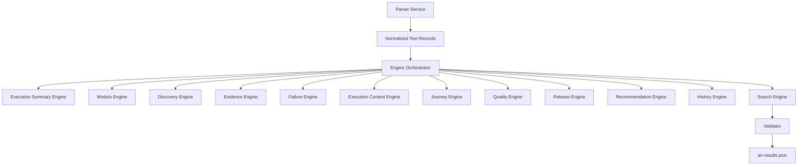

# AIR Core

AIR Core is the intelligence layer behind the dashboard.

## Mission

AIR Core turns normalized execution data into quality decisions, release recommendations, searchable evidence, and future analytics.

## Core Engines

| Engine | Purpose |
| --- | --- |
| Quality Engine | Calculates configurable quality score, confidence, grade, factors, weights, and explanation |
| Release Engine | Applies configurable release rules and decides GO / CONDITIONAL_GO / NO_GO |
| Journey Engine | Calculates journey status, health percentage, affected modules, not-executed steps, failed dependencies, recommendations, and business health |
| Module Engine | Calculates module health, coverage, test count, failure count, risk, and module recommendation |
| Discovery Engine | Detects mapped/unmapped tests, suggestions, and configuration issues |
| Evidence Engine | Classifies evidence, maps it to tests/modules/failures, and produces evidence summaries |
| Search Engine | Builds a normalized searchable index from AIR model sections |
| History Engine | Stores execution history and trends |
| Execution Context Engine | Detects execution type, scope, coverage, confidence, and validation level |
| Engine Orchestrator | Registers and executes AIR engines as a configurable pipeline |
| AI Engine | Explains and recommends |
| Execution Summary Engine | Calculates execution totals, status counts, flaky count, duration, pass rate, failure rate, and execution status |
| Failure Engine | Builds failedTests with severity, category, business impact, evidence, and investigation action |
| Recommendation Engine | Produces traceable next actions from normalized AIR data |

## Current Phase

AIR v1.1 should focus on data normalization, parser separation, and stable engine boundaries.

## Current AIR Core Boundary

The dashboard should depend on `air-results.json`.

AIR Core now loads automation data through:

- `scripts/air-core/services/parser-service.js`

The parser service delegates to framework adapters such as:

- `scripts/air-core/parser/playwright-parser.js`

This keeps Playwright as an input source, not the platform itself.

## Engine Dependency Flow

Journey Engine must consume AIR Core outputs such as `modules[]`, `failedTests[]`, execution summary, and configuration. It must not consume raw Playwright structures.

Release Engine must consume AIR Core outputs such as summary, `failedTests[]`, `modules[]`, `businessJourneys[]`, evidence, quality, and release configuration. It must not calculate quality or read framework-specific structures.

## Engine Independence Rule

Each AIR engine should be independently testable, independently replaceable, and should only enrich the AIR model within its own responsibility.

Engines must never depend on:

- Playwright-specific structures.
- Dashboard HTML.
- Other engine implementations.
- Project-specific hardcoding.

Engines may depend on normalized AIR records, configuration, and small shared utilities.

## Execution Summary Engine

Current implementation:

- `scripts/air-core/engine/execution-summary-engine.js`

Responsibilities:

- Total tests.
- Passed, failed, skipped, interrupted, and flaky counts.
- Duration.
- Pass rate.
- Failure rate.
- Execution status.

Non-responsibilities:

- No Playwright-specific logic.
- No UI logic.
- No release decision logic.
- No quality score logic.

## Failure Engine

Current implementation:

- `scripts/air-core/engine/failure-engine.js`

Responsibilities:

- Build `failedTests[]`.
- Include test name, module, status, severity, category, business impact, error message, evidence links, and recommended investigation action.
- Return an empty array when there are no failures.

Non-responsibilities:

- No Playwright-specific logic.
- No UI logic.
- No release decision logic.
- No module-health calculation.

## Release Engine

Current implementation:

- `scripts/air-core/engine/release-engine.js`

Responsibilities:

- Apply configured release rules.
- Decide `GO`, `CONDITIONAL_GO`, or `NO_GO`.
- Generate confidence, risk, reasons, warnings, blockers, required actions, and explanation.

Non-responsibilities:

- No Playwright-specific logic.
- No UI logic.
- No quality score calculation.
- No module, journey, evidence, or failure calculation.

## Discovery Engine

Current implementation:

- `scripts/air-core/engine/discovery-engine.js`

Responsibilities:

- Detect every executed test.
- Identify mapped and unmapped tests.
- Suggest module, journey, and criticality for unmapped tests.
- Report configuration issues such as missing module mapping, missing journey mapping, duplicate mapping, and orphaned mappings.

Non-responsibilities:

- No Playwright-specific logic.
- No UI logic.
- No automatic configuration modification.

## Search Engine

Current implementation:

- `scripts/air-core/engine/search-engine.js`

Responsibilities:

- Build `searchIndex[]` from the normalized AIR model.
- Index release, modules, journeys, tests, failed tests, evidence, recommendations, roadmap, and history.
- Avoid duplicate failed-test entries.
- Keep search entries framework-independent.

Non-responsibilities:

- No Playwright-specific logic.
- No HTML rendering.
- No browser event handling.

## History Engine

Current implementation:

- `scripts/air-core/engine/history-engine.js`

Responsibilities:

- Store execution history.
- Calculate quality, release, module, journey, pass rate, failure, duration, and coverage trends.
- Compare current execution with previous execution.
- Detect regressions and improvements.
- Return `First Execution` when there is no previous history.

Non-responsibilities:

- No UI logic.
- No Playwright-specific logic.
- No release calculation.

## Execution Context Engine

Current implementation:

- `scripts/air-core/engine/execution-context-engine.js`

Responsibilities:

- Detect execution type such as Regression, Smoke, Module, API, Database, Performance, Security, Accessibility, Feature, Future, or Custom.
- Calculate execution scope, executed modules, coverage, confidence, and validation level.
- Prevent partial module executions from being treated as full regression.

Non-responsibilities:

- No UI logic.
- No release, quality, or history calculation.

## Engine Orchestrator

Current implementation:

- `scripts/air-core/engine/engine-orchestrator.js`

Responsibilities:

- Register engines.
- Execute engines in dependency order.
- Pass the AIR model between engines.
- Log engine execution.
- Support continue-on-error behavior through configuration.
- Keep the builder orchestration-only.

## Rule

AIR Core should be reusable for any project and any automation framework.
