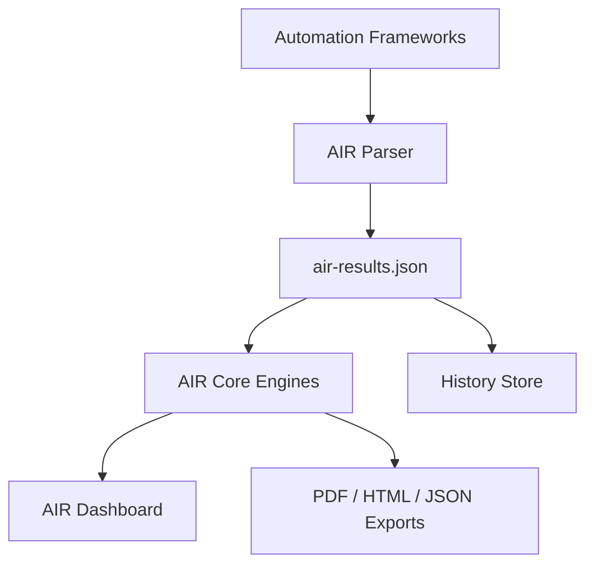

# Architecture

AIR separates execution, normalization, intelligence, and presentation.

## Layers

| Layer | Responsibility |
| --- | --- |
| Automation Framework | Executes tests and captures artifacts |
| Parser | Converts framework output into AIR model |
| AIR Data Model | Standard normalized contract |
| AIR Core Engines | Quality, release, module, journey, evidence, search, history, AI |
| Dashboard | Reads AIR model only |
| Export | Produces client-ready artifacts |

## Current Implementation

- Playwright JSON is parsed by `scripts/generate-air-results.js`.
- AIR model construction lives in `scripts/air-core/air-results-builder.js`.
- Dashboard generation lives in `scripts/generate-execution-report.js`.
- Configuration lives in `config/air.*.json`.

## Architecture Rule

Dashboard code should not contain framework-specific business logic. It should read `air-results.json` and render the normalized model.

