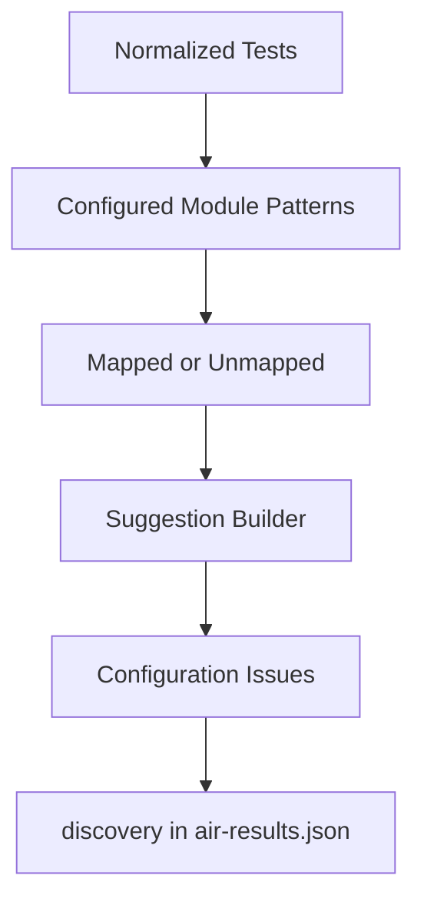

# Discovery Engine

The Discovery Engine makes AIR self-maintaining as automation coverage grows.

## Purpose

AIR should automatically detect executed tests, validate whether they map to configured modules and journeys, and report unmapped or ambiguous tests without requiring code changes.

## Implementation

- `scripts/air-core/engine/discovery-engine.js`

## Responsibilities

- Test discovery.
- Mapping validation.
- Unmapped test detection.
- Module suggestions.
- Journey suggestions.
- Criticality suggestions.
- Configuration issue reporting.
- Future configuration sync architecture.

## Non-Responsibilities

- No Playwright-specific logic.
- No UI logic.
- No automatic config modification.
- No fake mappings.
- No dashboard rendering.

## Output Contract

```json
{
  "discovery": {
    "summary": {
      "discovered": 69,
      "mapped": 69,
      "unmapped": 0,
      "newTests": 0,
      "suggestions": 0,
      "configurationIssues": 0
    },
    "newTests": [],
    "mappedTests": [],
    "unmappedTests": [],
    "suggestions": [],
    "configurationIssues": [],
    "configSync": {
      "status": "Prepared",
      "autoUpdateEnabled": false
    }
  }
}
```

## Discovery Flow



## Suggestion Workflow

When a test is unmapped, AIR suggests:

- Module.
- Business journey.
- Criticality.
- Confidence.

Suggestions are report-only. AIR does not update `air.modules.json` or `air.journeys.json` automatically.

## Configuration Validation

Discovery reports:

- Missing module configuration.
- Missing journey configuration.
- Duplicate mappings.
- Orphaned configured mappings for the current execution.

## Future Config Sync

Future AIR versions may allow approved suggestions to update configuration. The current implementation only prepares the architecture and never modifies config files.
