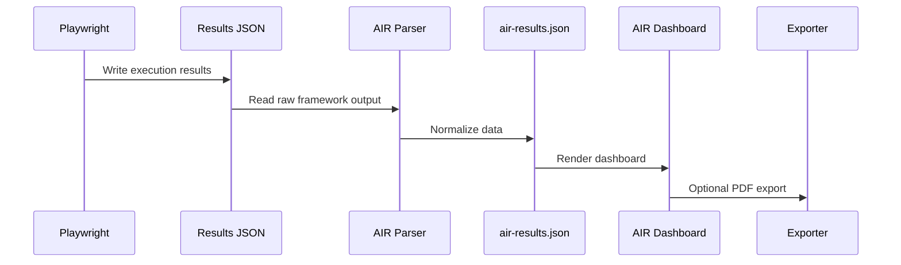

# System Architecture

AIR is currently generated as a static HTML dashboard, but it should be treated as a product platform with clear system boundaries.

## Runtime Flow

## Boundaries

- Tests own automation behavior.
- Parser owns raw result translation.
- AIR Core owns calculations and decisions.
- Dashboard owns presentation and interaction.
- Config owns project-specific mapping.

## Data Sources

Current:

- Playwright JSON reporter.
- Playwright artifacts: screenshots, videos, traces, logs when available.
- AIR config JSON files.

Future:

- API validation results.
- Database validation results.
- Performance results.
- Security scans.
- Historical execution store.

## Output Contracts

- `air-results.json` must be stable.
- Dashboard generation should be repeatable.
- PDF/HTML output should be generated from the same normalized model.

